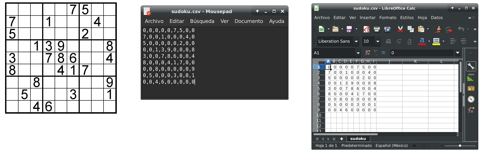

<!-- Badges -->
<p>
  
  <a href="#" target="_blank">
    
  </a>
  <a href="https://twitter.com/redacuve" target="_blank">
    
  </a>
</p>


<!-- Project Header -->
<p align="center">
    
  <br>
  <h1 align="center">Project Sudoku Solver</h1>
  <p align="center">
  <br>
   <a href="https://github.com/redacuve/sudoku-solver/"><strong>Explore the repo »</strong></a>
  <br>
  <a href="https://github.com/redacuve/sudoku-solver/issues">Request Feature</a>
  </p>

<!-- TABLE OF CONTENTS -->

## Table of Contents

* [About the Project](#about-the-project)

* [Built With](#built-with)

* [Getting Started](#getting-started)

* [How it Works](#how-it-works)

* [Contributing](#contributing)

* [License](#license)

* [Contact](#contact)

* [Acknowledgements](#acknowledgements)

<!-- ABOUT THE PROJECT -->

## About The Project

This is a sudoku solver, it read a sudoku from a csv file and tries to solve it.
Project written in Ruby Languaje.

### Built With

* [Ruby](https://ruby-doc.org/core-2.7.0/)

<!-- GETTING STARTED -->

## Getting Started

To get a local copy up and running follow these simple steps.

Clone or fork the <a href="https://github.com/redacuve/sudoku-solver">repo</a> [git@github.com:redacuve/sudoku-solver.git]

Note* Ruby needs to be installed to run the code, check [here](https://www.ruby-lang.org/en/documentation/installation/) for further steps

<!-- HOW IT WORKS -->
## How it Works

* It has two folders, bin is for the main program and lib is for the .csv file and the class sudoku

* Inside the sudoku.csv file, you need to fill in your sudoku (important! you need to put 0 on the empty spaces if you open the file with notepad or some text editor separate every number by a comma if you open the file with MS Excel or Office Calc put every number in a cell) Remember to put 9 numbers every row, see the example below.



* You're ready to solve it!

### Running the code

*   Navigate to the root directory of the project

*   Run this command on your terminal:
    ```
    $ ruby bin/main.rb
    ```
*   Now the result is on the terminal, enjoy!
<!-- CONTRIBUTING -->

## Contributing

Contributions are what make the open source community such an amazing place to be learn, inspire, and create. Any contributions you make are **greatly appreciated**.

1. Fork the Project

2. Create your Feature Branch (`git checkout -b feature/AmazingFeature`)

3. Commit your Changes (`git commit -m 'Add some AmazingFeature'`)

4. Push to the Branch (`git push origin feature/AmazingFeature`)

5. Open a Pull Request

<!-- LICENSE -->

## License

MIT License. For more information see <a href="https://github.com/redacuve/sudoku-solver/blob/master/LICENSE">here</a>

<!-- CONTACT -->

## Contact

Rey David Cuevas Vela - [@redacuve](https://twitter.com/redacuve) - redacuve@gmail.com

Project Link: [github.com/redacuve/sudoku-solver](https://github.com/redacuve/sudoku-solver) - Sudoku Solver.

<!-- ACKNOWLEDGEMENTS -->

## Acknowledgements

* [Rey David Cuevas Vela](https://github.com/redacuve)
